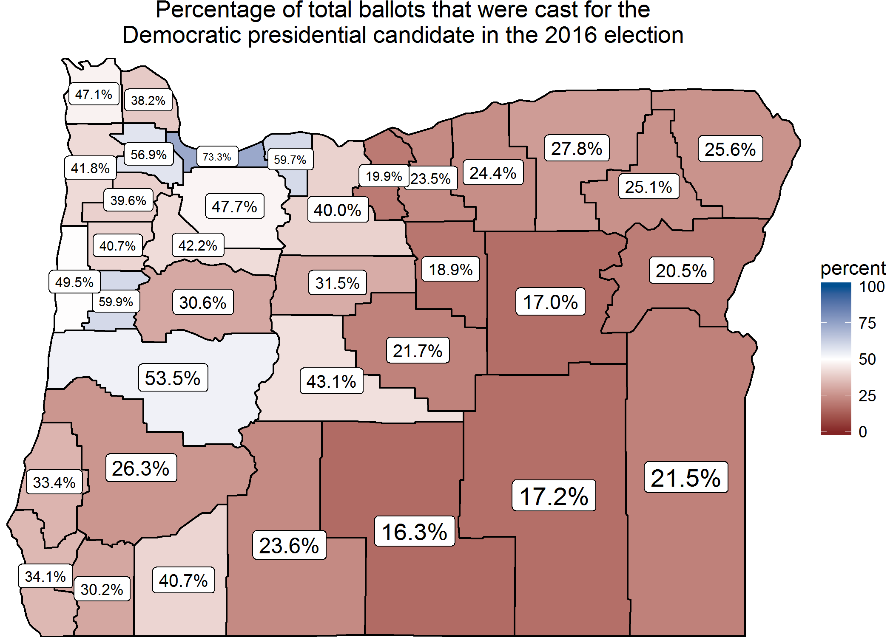

Oregon election 2016
====================

To move away from binary thinking, plots of election results by county can help display the diversity of voting across the state. In addition, making plots of eligible voters and/or population per county helps avoid confusing geographic area with number of voters.

Currently missing data:

> 1.  Demographics by county
> 2.  Senator election results

Currently missing plots of interest:

> 1.  Somehow combining election results with population to show weighted results

Oregon plots
------------

### Eligible voters

The Oregon Secretary of State keeps records of the number of eligible voters for each county. They have data by month, and also have the data for the election stored at <http://results.oregonvotes.gov/VoterTurnoutDetails.aspx?map=TURN>. Population data for each county is also available, but that plot is not included here as the result is essentially identical to the plot below of eligible voters.

### Voter turnout

Oregon voter turnout is fairly high overall, but there is some interesting variation across the counties in the state.

   

 

I found adding labels with the values of each county helped in my understanding of any patterns.

   

### Percentage votes for candidates

To get a better idea of the voting across that state, the following plots show the percentage of ballots case for each candidate (Republican, Democrat, Other). The color scale for the party votes goes from 0 to 100 percent, although no party got nearly as much/little as 100%/0% of the county votes.

The same plot is given twice, once with and once without labels.

#### Republican

   

   

   

#### Democrat

   

   

   

### Third-party and write-in

In this particular dataset, all third-party and write-in votes were lumped together. The range of the percentage of votes casting ballots of third-party/write-in ranged from about 5% to 12%.

   

